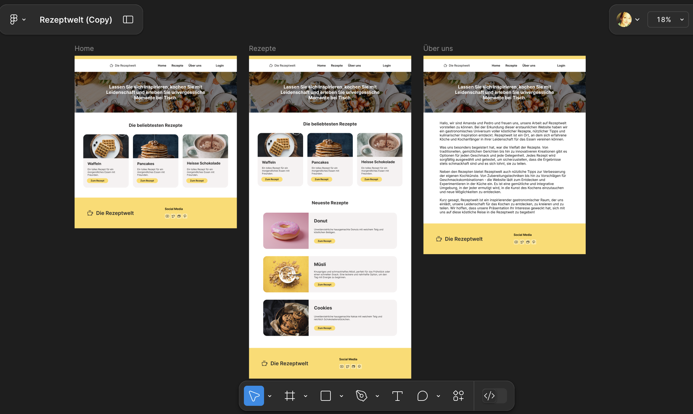
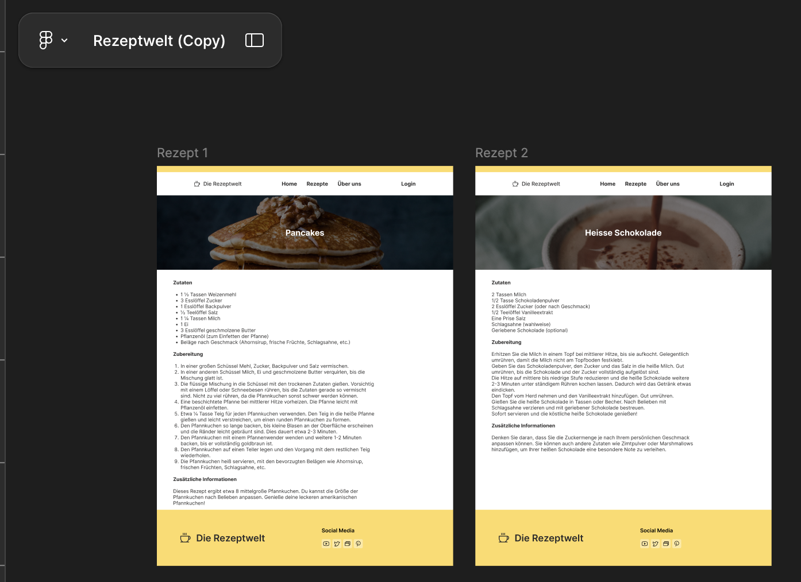

# Project Rezepte
lang: de, js, ts, 

## Project about yummi recepies 👾


_______________
## Exercise/Project focuses on:
- usage of SUPABASE DB
- practice DB access ( Supabase -> React Project -> insertDeploymentTool)
- Duplicate/Realise/Create from a Figma Project

_____________
## AI created Project about yummi recepies 👾
AI tool: gpt -> bolt.new 
_____________

## current CodeStatus:
- first draft from bolt.
- added assets (img / font)
- rudimental setup in VSCode
- parked csv files in folder data.  created by bolt. context used for the prompt, where earlier csv files - used to import into supabase DB. will import into supabase later and remove files from repo.
- already shows the page - flat like in figma. links, router, db connection will follow


____________
automatically created README.md by bolt.new:

# Anima Project

Welcome! This project has been automatically generated by [Anima](https://animaapp.com/).

## Getting started

> **Prerequisites:**
> The following steps require [NodeJS](https://nodejs.org/en/) to be installed on your system, so please
> install it beforehand if you haven't already.

To get started with your project, you'll first need to install the dependencies with:

```
npm install
```

Then, you'll be able to run a development version of the project with:

```
npm run dev
```

After a few seconds, your project should be accessible at the address
[http://localhost:5173/](http://localhost:5173/)


If you are satisfied with the result, you can finally build the project for release with:

```
npm run build
```
# SuperRezepte
